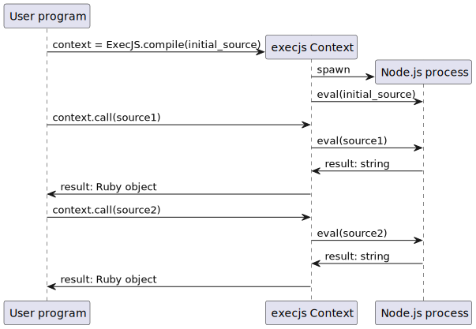
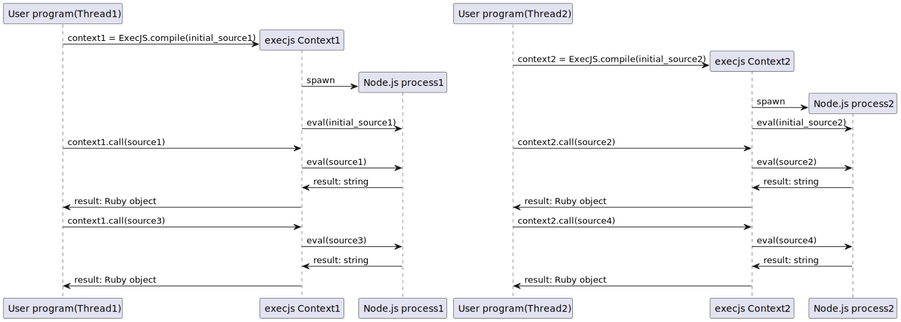

# ExecJS::PCRuntime

Accelerated ExecJS Runtime by launching Node.js Processes per Context, not per execution.

inspired by [execjs-fastnode](https://github.com/jhawthorn/execjs-fastnode)

## How PCRuntime fast?

The existing Node.js runtime spawns a Node.js process for each eval, regardless of whether it compiles or not.
To reduce this overhead, execjs-fastnode is designed to launch a single Node.js process and manage the Context in JavaScript.

|                                           Node.js                                           |                                          execjs-fastnode                                           |
|:-------------------------------------------------------------------------------------------:|:--------------------------------------------------------------------------------------------------:|
|  |  |

execjs-fastnode is designed to limit the number of threads that can access a Node.js process to 1 to avoid the race condition when multiple Contexts are used.
execjs-pcruntime works lock-free by creating a Node.js process for each Context.
This improves performance when used with multi-threading.

|                                             execjs-fastnode(multi-threading)                                              |                                        execjs-pcruntime                                         |
|:-------------------------------------------------------------------------------------------------------------------------:|:-----------------------------------------------------------------------------------------------:|
|  |  |

## Requirements

- Ruby >= 3.0.0
- execjs ~> 2.0

## Installation

Add this line to your application's Gemfile:

```ruby
gem 'execjs-pcruntime'
```

And then execute:
```shell
bundle
```

## Usage

Once installed, the Runtime will automatically be replaced.
If you want to set it, you can use environment variable `EXECJS_RUNTIME=PCRuntime`.

## Development

After checking out the repo, run `bin/setup` to install dependencies. Then, run `rake test` to run the tests. You can also run `bin/console` for an interactive prompt that will allow you to experiment.

To install this gem onto your local machine, run `bundle exec rake install`. To release a new version, update the version number in `version.rb`, and then run `bundle exec rake release`, which will create a git tag for the version, push git commits and tags, and push the `.gem` file to [rubygems.org](https://rubygems.org).

### Test

To run a unit test, run the following command.

```shell
bundle exec rake
```

## Contributing

Bug reports and pull requests are welcome on GitHub at https://github.com/[USERNAME]/execjs-pcruntime. This project is intended to be a safe, welcoming space for collaboration, and contributors are expected to adhere to the [Contributor Covenant](http://contributor-covenant.org) code of conduct.

## License

The gem is available as open source under the terms of the [MIT License](https://opensource.org/licenses/MIT).

## Code of Conduct

Everyone interacting in the Execjs::Pcruntime project’s codebases, issue trackers, chat rooms and mailing lists is expected to follow the [code of conduct](https://github.com/[USERNAME]/execjs-pcruntime/blob/master/CODE_OF_CONDUCT.md).
